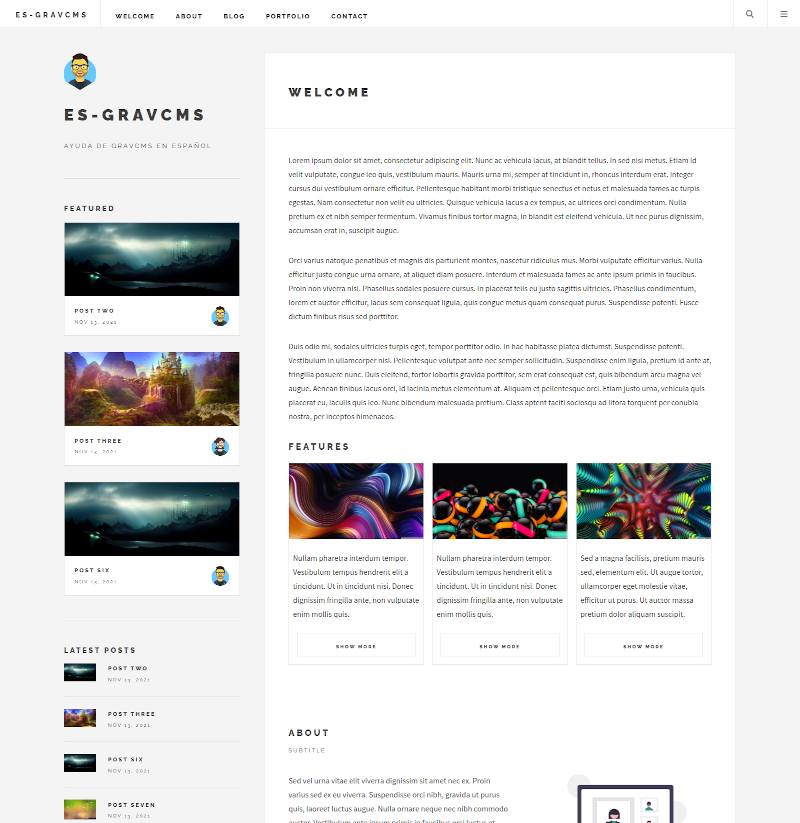

# Future Theme for Grav

Future Imperfect by [HTML5UP](http://www.html5up.net), features a clean, minimalistic design, styling for all basic page elements and HTML5/CSS3 code designed for quick and easy customization.

# Features

* HTML5 and CSS3
* Fully Responsive
* Microdata for blogs
* ARIA accessibility conformance
* Various templates for presenting your content
* Randomised page content in sidebar
* Top content pages in sidebar
* Styling for all basic page elements
* Styling for various modules
* Cross browser compatible
* Dynamic avatar images based on author
* Sharing buttons for Facebook and Twitter with share count.

# Installation

Installing the Future theme can be done in one of two ways. Our GPM (Grav Package Manager) installation method enables you to quickly and easily install the theme with a simple terminal command, while the manual method enables you to do so via a zip file.

The theme by itself is useful, but you may have an easier time getting up and running by installing a skeleton.

# Dynamic avatars

Dynamic avatar images for each author must be placed inside the `/your/site/grav/user/themes/future/images` directory as JPG. Each avatar image should be a lowercase version of the author. i.e. Fred Bloggs becomes fred-bloggs.jpg

## GPM Installation (Preferred)

The simplest way to install this theme is via the [Grav Package Manager (GPM)](http://learn.getgrav.org/advanced/grav-gpm) through your system's Terminal (also called the command line).  From the root of your Grav install type:

    bin/gpm install future

This will install the Future theme into your `/user/themes` directory within Grav. Its files can be found under `/your/site/grav/user/themes/future`.

## Manual Installation

To install this theme, just download the zip version of this repository and unzip it under `/your/site/grav/user/themes`. Then, rename the folder to `future`. You can find these files either on [GitHub](https://github.com/absalomedia/grav-theme-future) or via [GetGrav.org](http://getgrav.org/downloads/themes).

You should now have all the theme files under

    /your/site/grav/user/themes/future

>> NOTE: This theme is a modular component for Grav which requires the [Grav](http://github.com/getgrav/grav), [Error](https://github.com/getgrav/gravplugin-error) and [Problems](https://github.com/getgrav/grav-plugin-problems) plugins.

# Updating

As development for the Future theme continues, new versions may become available that add additional features and functionality, improve compatibility with newer Grav releases, and generally provide a better user experience. Updating Future is easy, and can be done through Grav's GPM system, as well as manually.

## GPM Update (Preferred)

The simplest way to update this theme is via the [Grav Package Manager (GPM)](http://learn.getgrav.org/advanced/grav-gpm). You can do this with this by navigating to the root directory of your Grav install using your system's Terminal (also called command line) and typing the following:

    bin/gpm update future

This command will check your Grav install to see if your Future theme is due for an update. If a newer release is found, you will be asked whether or not you wish to update. To continue, type `y` and hit enter. The theme will automatically update and clear Grav's cache.

## Manual Update

Manually updating Future is pretty simple. Here is what you will need to do to get this done:

* Delete the `your/site/user/themes/future` directory.
* Download the new version of the Future theme from either [GitHub](https://github.com/absalomedia/grav-theme-future) or [GetGrav.org](http://getgrav.org/downloads/themes).
* Unzip the zip file in `your/site/user/themes` and rename the resulting folder to `future`.
* Clear the Grav cache. The simplest way to do this is by going to the root Grav directory in terminal and typing `bin/grav clear-cache`.

> Note: Any changes you have made to any of the files listed under this directory will also be removed and replaced by the new set. Any files located elsewhere (for example a YAML settings file placed in `user/config/themes`) will remain intact.

# Setup

If you want to set Future as the default theme, you can do so by following these steps:

* Navigate to `/your/site/grav/user/config`.
* Open the **system.yaml** file.
* Change the `theme:` setting to `theme: future`.
* Save your changes.
* Clear the Grav cache. The simplest way to do this is by going to the root Grav directory in Terminal and typing `bin/grav clear-cache`.

Once this is done, you should be able to see the new theme on the frontend. Keep in mind any customizations made to the previous theme will not be reflected as all of the theme and templating information is now being pulled from the **future** folder.

# Contact Form Configuration
For contact form configuration instructions please refer to [official documentation](http://learn.getgrav.org/forms/forms/example-form). Make sure you installed Email and Form plugin though.
